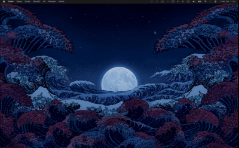

# WallpaperSwitcher

WallpaperSwitcher is a small macOS menu bar app I built for my own personal need: keeping separate light and dark mode wallpaper pools and switching between them without opening System Settings.

The app runs as an agent-style menu bar utility with no Dock icon. It watches for macOS appearance changes, applies the next wallpaper from the matching pool, and can rotate wallpapers on a schedule.

## Showcase




## Features

- Menu bar app with no Dock icon
- Status item using the `photo.on.rectangle` SF Symbol
- Manual `Set wallpaper now` action from the menu bar
- Separate wallpaper lists for light mode and dark mode
- Automatic switching when macOS changes between light and dark appearance
- Optional rotation schedule:
  - Every 30 minutes
  - 1 hour
  - 3 hours
  - On login only
- Optional launch at login using `ServiceManagement`
- Settings window for adding and removing wallpaper images
- Persistence through `UserDefaults`
- Applies wallpaper to all detected screens
- Attempts to update the Dock desktop picture database so all Spaces use the selected wallpaper

## Project Structure

- `WallpaperSwitcherApp.swift` contains the SwiftUI app entry point and `AppDelegate`.
- `MenuBarController.swift` owns the menu bar status item and menu actions.
- `SettingsView.swift` contains the SwiftUI settings UI.
- `AppearanceMonitor.swift` observes macOS appearance changes and exposes the current dark/light state.
- `WallpaperCoordinator.swift` stores wallpaper pools, persists settings, rotates wallpapers, and applies desktop images.

## Building

Open `WallpaperSwitcher.xcodeproj` in Xcode and run the `WallpaperSwitcher` scheme.

You can also build from the command line:

```sh
xcodebuild -project WallpaperSwitcher.xcodeproj -scheme WallpaperSwitcher -configuration Debug build
```

## Notes

This project is intentionally focused on my own workflow rather than being a polished general-purpose wallpaper manager. Some behavior, especially updating wallpapers across all Spaces through the Dock database, may depend on macOS internals and can change across macOS versions.
